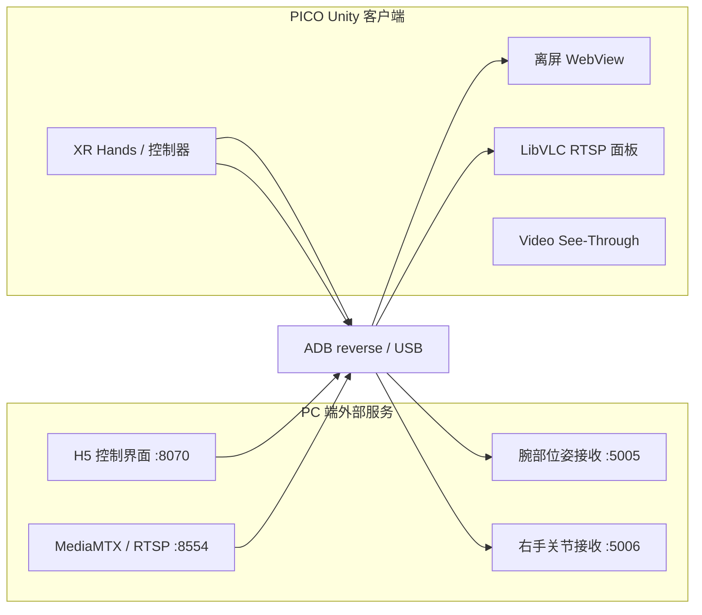

# UEM Control PDC Live Preview

面向 PICO 头显的 Unity XR 控制与实时预览端。当前版本把 PICO 透视、H5 控制界面、RTSP 相机画面、手腕/控制器位姿和右手 21 关节数据集成到同一个 XR 场景中。

本仓库只包含 Unity/PICO 客户端。H5 服务、RTSP 推流、TCP 接收与机器人控制程序由外部 PC 端工程提供，通常来自配套的 `Control-Program-For-5-DOF` 工作区。

## 当前入口

- Unity：`2022.3.15f1c1`
- 构建平台：Android / PICO
- Build Settings 中启用的场景：
  `Assets/Samples/XR Interaction Toolkit/2.5.2/Hands Interaction Demo/HandsDemoScene.unity`
- PICO XR SDK：本地包 `PICO-Unity-Integration-SDK release 3.4.0`
- Unity MCP：`com.ivanmurzak.unity.mcp 0.87.0`
- XR Hands：`1.3.0`

`Assets/Scenes/SampleScene.unity` 和本地实验场景不是当前 Build Settings 的正式入口；切换场景前请先核对其组件与地址配置。

## 运行拓扑



PICO 内的 `127.0.0.1` 指向头显自身。PC 服务通过 USB 提供时，需要为实际使用的端口建立反向转发：

```powershell
adb reverse tcp:8070 tcp:8070
adb reverse tcp:8554 tcp:8554
adb reverse tcp:5005 tcp:5005
adb reverse tcp:5006 tcp:5006
adb reverse --list
```

只需转发本次运行实际使用的端口。重新连接头显或 ADB 服务后应再次检查规则。

## 已实现模块

| 模块 | 脚本 | 当前行为 |
| --- | --- | --- |
| PICO 透视 | `PicoSeeThroughBootstrap.cs` | 启动、恢复前台时启用 `PXR_Manager.EnableVideoSeeThrough`，并配置透明相机背景。 |
| H5 面板 | `UemH5WebViewPanel.cs` | Android 离屏 WebView，活动场景默认加载 `http://127.0.0.1:8070/control_ui/index.html?vr=1`。 |
| RTSP 面板 | `UemNetworkCameraPanel.cs` | LibVLCSharp 解码 RTSP 并上传 Unity 纹理；默认 URL 为 `rtsp://127.0.0.1:8554/usb_camera`。 |
| USB 相机备选 | `UemUsbCameraPanel.cs` | 使用 `WebCamTexture` 枚举 Android Camera/UVC 设备，默认优先名称含 `DSJ` 的设备。 |
| 腕部/控制器位姿 | `WristPoseTcpSender.cs` | 以 TCP 文本行发送 XR 手腕和/或右控制器位姿，默认 `127.0.0.1:5005`、60 Hz。 |
| 右手 21 关节 | `RightHandUnityUdpTcpSender.cs` | 当前实现实际使用 TCP，以 JSON 行发送右手 21 关节，默认 `127.0.0.1:5006`、60 Hz。 |
| 状态显示 | `WristPoseDisplay.cs`、`WristPoseDisplayInstaller.cs` | 在视野内显示左右腕部位姿和左手握拳 deadman 状态。 |
| 交互开关 | `WristPoseControlToggle.cs` | 提供按住启用或切换式视觉状态，并调用发送器的 `SetControlEnabled`。 |

### RTSP 低延迟配置

活动场景当前使用：

| 参数 | 值 |
| --- | ---: |
| URL | `rtsp://127.0.0.1:8554/usb_camera` |
| RTSP 传输 | TCP |
| Network caching | 20 ms |
| Live caching | 20 ms |
| 首帧等待 | 2 s |
| 无解码帧判定 | 0.5 s |
| 重连冷却 | 1 s |

播放器启用了迟帧丢弃和跳帧。watchdog 检测到一段时间没有新的解码帧时会重启流，以清理阻塞队列。它只能检测“没有新解码帧”，不能识别内容持续到达但已经落后实时源的情况。

### H5 面板说明

Android 插件位于 `Assets/Plugins/Android/UemWebViewPlugin.androidlib`，允许明文 HTTP，并声明网络、相机和录音权限。当前脚本完成了离屏渲染、刷新频率切换和纹理显示；VR 射线指针字段仍保留，但当前 `HandlePointerInput` 没有执行点击/滚动交互，因此不要把射线交互视为已完成能力。

## 环境准备

1. 安装 Unity Hub 和 Unity `2022.3.15f1c1`，包含 Android Build Support、SDK、NDK 与 OpenJDK。
2. 准备 PICO Unity Integration SDK 3.4.0。
3. 检查 `Packages/manifest.json` 中的本地依赖：

   ```json
   "com.unity.xr.picoxr": "file:D:/桌面1/PICO-Unity-Integration-SDK-release_3.4.0"
   ```

   该路径是当前开发机路径。其他机器必须改成自己的 SDK 位置，否则 Unity 无法解析 PICO XR 包。

4. 用 Unity Hub 打开仓库根目录，等待 Package Manager 和脚本导入完成。
5. 打开 Build Settings 中启用的 Hands Demo 场景，核对 Inspector 中的 URL、端口和组件引用。
6. 在 PC 端启动需要的 H5、RTSP 和 TCP 服务，再建立 ADB reverse。

仓库包含 Windows 编辑器预览所需的 LibVLC 文件，以及 Android `arm64-v8a` / `armeabi-v7a` 的 `libvlc.so` 与 `libc++_shared.so`。这些原生插件是项目依赖，不应作为普通构建产物删除。

## 外部 RTSP 推流要求

Unity 端只负责拉流，不负责启动摄像头或 MediaMTX。当前配套方案约定：

- RTSP 地址：`rtsp://127.0.0.1:8554/usb_camera`
- 视频编码：H.264 / `yuv420p`
- 目标帧率：20 fps
- 建议：无 B 帧、`zerolatency`、短 GOP、关闭 mux delay
- ADB：`adb reverse tcp:8554 tcp:8554`

开发机测试中观察到的端到端延迟，仅用于定位而不是性能承诺：

- 单相机 640×480@20 fps：约 0.3–0.45 s
- 双相机纵向合成 640×960@20 fps：约 0.5–0.7 s

两台相机目前共享同一个 USB XHCI/Hub 上游路径；双路采集时还增加了 OpenCV 解码、Python 原始帧复制、纵向合成和更大的 H.264 帧。延迟增加的具体占比尚未通过严格的单变量实验确认。

PC 端诊断 VLC 时必须覆盖其默认 1000 ms 网络缓存，否则测量结果会被播放器默认缓存主导：

```powershell
& 'E:\VLC\vlc.exe' `
  --no-one-instance `
  --rtsp-tcp `
  --network-caching=50 `
  --live-caching=50 `
  --clock-jitter=0 `
  --drop-late-frames `
  --skip-frames `
  'rtsp://127.0.0.1:8554/usb_camera'
```

VLC 路径应替换为本机实际安装位置。

## TCP 数据格式

### 腕部与控制器位姿

`WristPoseTcpSender` 每行发送一条 CSV：

```text
sequence,unity_time,hand,tracked,px,py,pz,qx,qy,qz,qw,source,deadman
```

- `source`：`xr_hand_wrist` 或 `right_controller`
- `tracked`：`1` 表示位姿有效，`0` 表示当前不可用
- XR 手腕的 `deadman`：来自左手握拳状态
- 右控制器的 `deadman`：来自左控制器主按钮

发送器会持续输出状态行；接收端必须同时检查 `tracked`、`source` 和 `deadman`，不能仅凭 TCP 连接存在就执行运动。

当前 `WristPoseControlToggle` 会更新发送器内部的 `ControlEnabled` 状态和场景视觉效果，但 `WristPoseTcpSender` 尚未使用该字段停止发送或改写 `deadman`。因此它目前不是独立的运动安全门控，真正执行侧仍必须校验数据中的 deadman。

### 右手 21 关节

`RightHandUnityUdpTcpSender` 通过 TCP 发送换行分隔 JSON，主要字段包括：

```json
{
  "frameId": 0,
  "unityTime": 0.0,
  "source": "xr-hands",
  "jointFormat": "unity-xr-hands-26-to-mediapipe21",
  "hand": "right",
  "rightTracked": true,
  "rightPositions": [],
  "rightRotations": [],
  "leftPositions": [],
  "leftRotations": []
}
```

位置和欧拉角数组各包含 `21 × 3` 个浮点数。任一右手关节位姿不可用时，当前帧会被跳过。

## 目录结构

```text
Assets/
  Plugins/          WebView、LibVLCSharp、Android/Windows 原生依赖
  Resources/        PICO 设置、运行材质和 Shader
  Samples/          当前 Hands Demo 场景及 XRI/XR Hands 示例资源
  Scenes/           早期/备用场景
  Scripts/          UEM 运行逻辑
  Shaders/          视频面板 Shader
Packages/           UPM manifest 与锁文件
ProjectSettings/    Unity 与 XR 项目设置
```

Unity 自动生成的 `Library`、`Temp`、`Logs`、`Builds`、IDE 工程文件、本地 MCP 状态和 APK 不应提交；规则见 `.gitignore`。

## 常见问题

### Unity 无法解析 PICO XR 包

检查 `Packages/manifest.json` 中的 `file:` 路径，并确认目标目录包含同版本 PICO SDK。

### PICO 中 H5 或 RTSP 无法连接

1. 确认 PC 服务正在监听对应端口。
2. 执行 `adb reverse --list`。
3. 确认场景仍使用 `127.0.0.1` 和约定端口。
4. 检查 Android 网络权限和明文 HTTP 设置。

### RTSP 有画面但延迟持续增加

检查推流端是否持续以实时速度运行、是否出现编码管道背压，以及客户端是否仍在使用默认 VLC 缓存。当前 watchdog 只处理停止出帧，不能根据画面内容时间戳主动追赶实时源。

### USB 相机没有出现在 PICO

`UemUsbCameraPanel` 依赖 Android Camera API 可枚举 UVC 设备。检查扩展坞供电、Camera 权限和 PICO 系统是否向应用暴露设备。当前主链路优先使用 PC 采集后经 RTSP/ADB USB 转发。

### TCP 已连接但机器人不应运动

连接成功不代表控制有效。接收端必须检查 `tracked` 和 `deadman`，并保留自己的限幅、超时与急停策略。

## 验证边界

README 描述的是当前源码和场景序列化配置。摄像头延迟数字来自本地台架观察，不是跨设备保证；机器人运动安全、长期稳定性和完整实验结果需要在目标硬件上另行验证。
